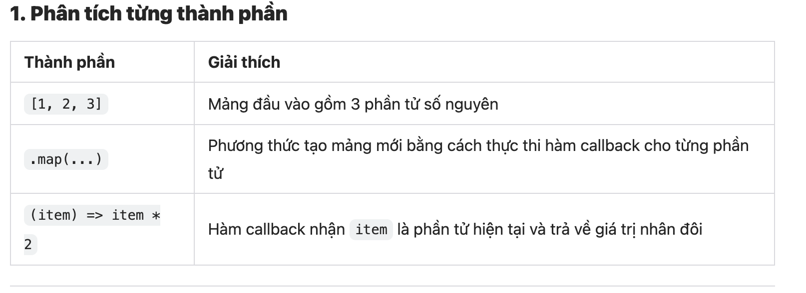
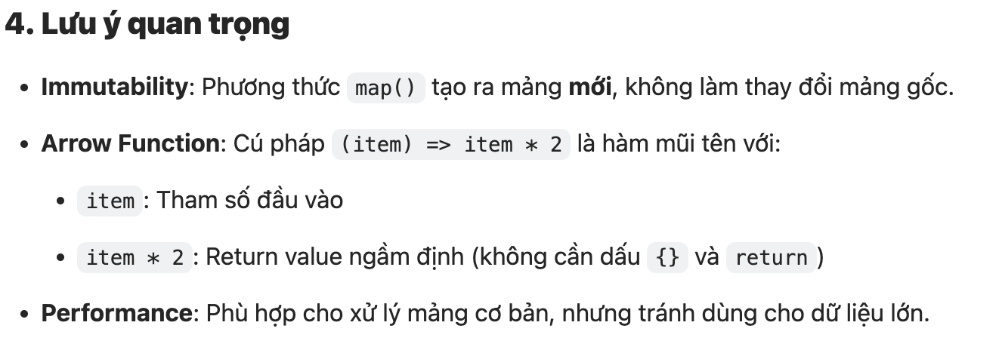

# Toán tử logic và template string

## Toán tử logic

Dựa trên Truthy và Falsy. Hay còn gọi là đúng và sai

Ngoài những giá trị sau ra thì tất cả đều đúng: `false`, `0`,`0n`, `undefined`, `null`, `''`, `NaN`

### Toán tử và: `&&`

Chỉ cần gặp falsy hoặc đi đến cuối cùng là nó sẽ dừng lại và return về giá trị dừng

```js
const a = true
const b = ''
const c = 'Hi'

const d = a && b && c // ''
```

### Toán tử hoặc: `||`

Chỉ cần gặp truthy hoặc đi đến cuối cùng là nó sẽ dừng lại và return giá trị dừng

```js
const a = null
const b = 12
const c = 'Hi'

const d = a || b || c // 12
```

### Toán tử phủ định: `!`

```js
const a = null
const b = 12
const c = 'Hi'

const d = !(a || b || c) // false, vì phủ định truthy

let check = 8
const handle = () => {
  return [1, 2, 3].map((item) => item *2)
}
// mở rộng
const handle1 = () => {
  return [1, 2, 3].map((item, index) => item * index)
}

let value = []
// if (check > 9) {
//   value = handle()
// }
value = check > 9 && handle()
console.log(value)
console.log('handle1: ', handle1())
```



### Toán tử 3 ngôi

```js
let fname = 'alex'

fname === 'alex' ? console.log('true') : console.log(false)
```

## Optional chaining `?.`

Khi ta cố truy cập thuộc tính của `undefined` hoặc `null` thì sẽ xảy ra lỗi.

Ví dụ `user.address` sẽ là `undefined`, nếu ta có truy cập vào thêm `street` thì sẽ gặp lỗi

```js
let user = {} // biến user không có thuộc tính "address"

alert(user.address.street) // Error!
```

Những lúc như thế này để tránh lỗi thì chúng ta phải đặt điều kiện

```js
let user = {}

user.address ? alert(user.address.street) : alert(undefined)
```

Hoặc cách ngắn hơn là dùng `?.`

```js
let user = {}
alert(user?.adress?.street) // undefined
```

Nếu gặp `undefined` hay `null` thì nó sẽ dừng truy cập và trả về `undefined` ngay lập tức.

## Toán tử nullist `??`

Dùng trong trường hợp cần check một giá trị có phải là `undefined` hay `null` không

```js
let user

alert(user ?? 'Anonymous') // Anonymous (user not defined)
```

`??` khác với `||` là `||` nó check theo falsy, bao gồm `0` hay `''`, `NaN`

## Template String

```js
let a = `string text`

let b = `string text line 1
 string text line 2`

let c = `string text ${a} string text`
```
